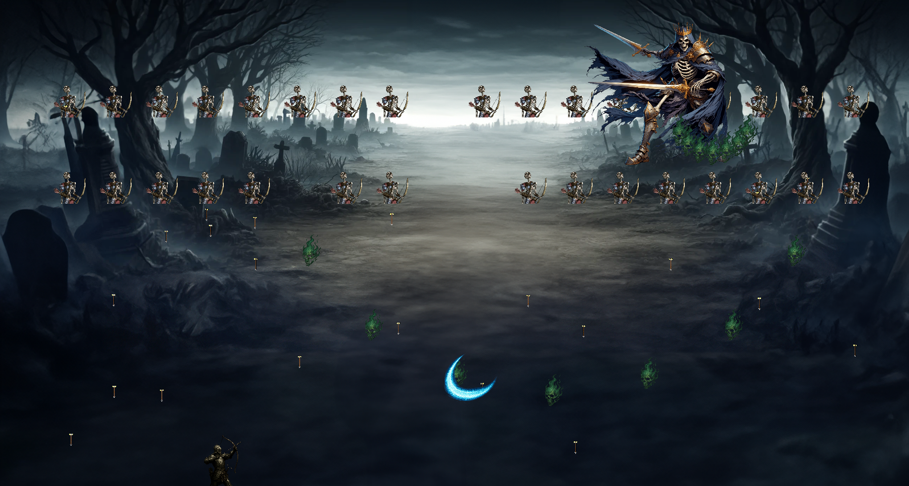
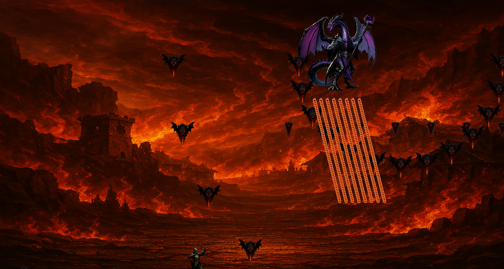
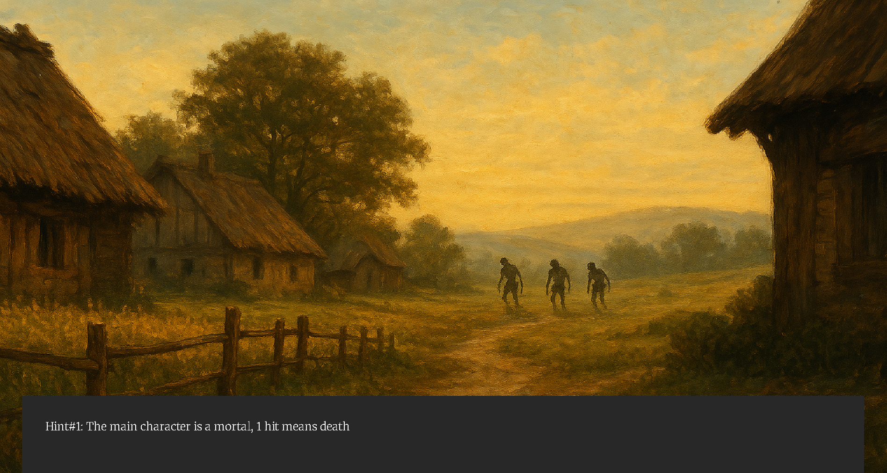

## Game Engine Description

The game engine behind Old Bow is a fully modular, component-based system designed for flexibility and fast iteration. 
Every game entity(the player, enemies, projectiles) or even dialogue triggers — is built by assembling
reusable components. This allows behaviors like movement, collision, input handling, and rendering to be added or modified
independently.

A key feature of this engine is its data-driven design. Boss configurations(name, health, attack patterns, and 
textures) are loaded from external text files. Scene narratives and background images are also driven by external data, 
making it easy to expand the game's story and introduce new encounters without changing the code.

The engine uses a scene management system to handle level transitions and cutscenes. Each scene controls its own entities
and gameplay logic, while the application coordinates switching between scenes at runtime.

Boss behavior is defined in their classes, but fire patterns are dynamically specified through parameters passed to the
projectile system. This allows a variety of complex attack patterns, such as bouncing shots, tracking missiles, spread 
shots, and the rapid-fire "dragon breath" attack.

To ensure clarity during story sequences, the engine includes a dedicated dialogue state that pauses all gameplay, allowing
players to safely follow the narrative before combat resumes.

Finally, the engine is designed for future growth. Systems like scoring and player abilities are already scaffolded, 
leaving room for more advanced mechanics like player buffs, health management, and free directional movement.

# Video Trailer

[Watch the video trailer](https://youtu.be/GSg57cVzZAA)

# Screenshots

